# Visual Similarity Search with Metric Learning on Stanford Online Products

## Introduction

This project builds an instance-level visual similarity (image retrieval) system using deep metric learning. Starting from a pretrained ConvNeXt backbone, I fine-tuned the model using supervised contrastive learning on the Stanford Online Products (SOP) dataset, resulting in a significant improvement in retrieval performance measured by Recall@K. I validated robustness under domain shift by querying real-world phone images against the SOP catalog.

The project covers the full pipeline:

- Dataset understanding and preprocessing
- Embedding extraction
- Metric learning fine-tuning
- FAISS-based nearest-neighbor retrieval
- Quantitative evaluation of retrieval
- Qualitative (visual) error analysis

## Motivation

Image retrieval problems arise in many real-world applications, such as:

- Product and spare-parts matching
- Visual search in e-commerce
- Deduplication and catalog cleaning
- Tool or component identification from images

Rather than classification, these tasks require learning a good embedding space where visually similar items are close together. This project demonstrates how metric learning can significantly improve retrieval quality over off-the-shelf pretrained embeddings.

## Dataset

I used the [Stanford Online Products (SOP) dataset](https://service.tib.eu/ldmservice/dataset/stanford-online-products), a standard benchmark for metric learning. Some of the characteristics of the data include:

- 120,053 images (split into ~59,551 train and ~60,502 test set)
- 22,634 product instances (`class_id`)
- 12 high-level categories (`super_class_id`)

The focus in this project is the `class_id`. Each product instance (`class_id`) has multiple images taken from different viewpoints and conditions. Many instances have only 2 images, making the task challenging. Below is the plot of the number of images per `class_id`.


Dataset reference:

> Song et al., Deep Metric Learning via Lifted Structured Feature Embedding, CVPR 2016

## Method Overview

I started by using the pretrained `ConvNeXt-Base` model to generate emebeddings followed by retrieval using FAISS and evaluating retrieval results. The model backbone was then fine-tuned using the train set while adding a projection head that outputs 256-dimensional embeddings. For fine-tuning, I initially implemented supervised contrastive (SupCon) loss from scratch but then migrated to `pytorch-metric-learning` for reliability and extensibility. The SupCon loss optimises the separation of embeddings by pulling embeddings belonging to the same class closer together while pushing samples from different classes further apart.

### Baseline

- Backbone: ConvNeXt-Base (ImageNet pretrained, via timm)
- Embeddings extracted without task-specific fine-tuning
- Retrieval performed using FAISS with cosine similarity

### Fine-tuned Model

- Backbone: ConvNeXt-Base
- Projection head: 2-layer MLP → 256-dimensional embeddings
- Loss: Supervised Contrastive Loss (pytorch-metric-learning)
- Sampling: PK sampling (P classes × K images per class)
- Optimization: AdamW
- Early stopping based on validation Recall@1
- Embeddings extracted, retrieval performed and evaluated

### Retrieval

- Embeddings are L2-normalized
- FAISS IndexFlatIP (inner product = cosine similarity)
- Evaluation with Recall@1 / Recall@5 / Recall@10

## Results

The results include a comparison of the pretrained model with and without fine-tuning on the train set. In the section, the embeddings are visualised, the retrieval performance is evaluated and errors are analysed.

### Generated Embeddings

The embeddings generated by the pretrained model, without fine-tuning, are visualised here in 2D to show the clusters of image samples where classes have been grouped together in the embeddings space. In addition, the 3D space

<p align="center">
  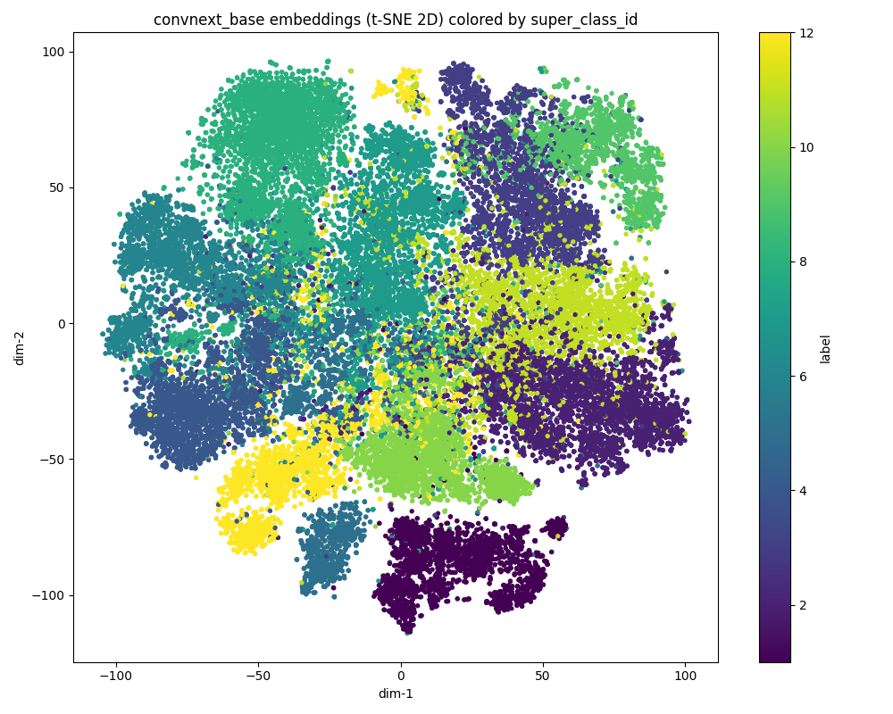
  <br>
  <em>t-SNE projection of pretrained ConvNeXt embeddings colored by super_class (2D).</em>
</p>

<p align="center">
  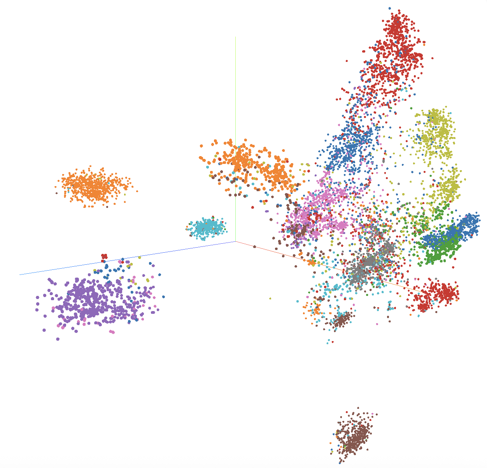
  <br>
  <em>t-SNE projection of pretrained ConvNeXt embeddings colored by super_class (3D).</em>
</p>

Similarly, the embeddings generated by the fine-tuned model are shown

<p align="center">
  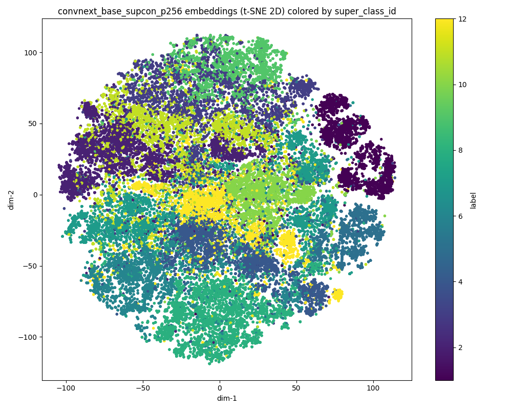
  <br>
  <em>t-SNE projection of finetuned ConvNeXt embeddings colored by super_class (2D).</em>
</p>

<p align="center">
  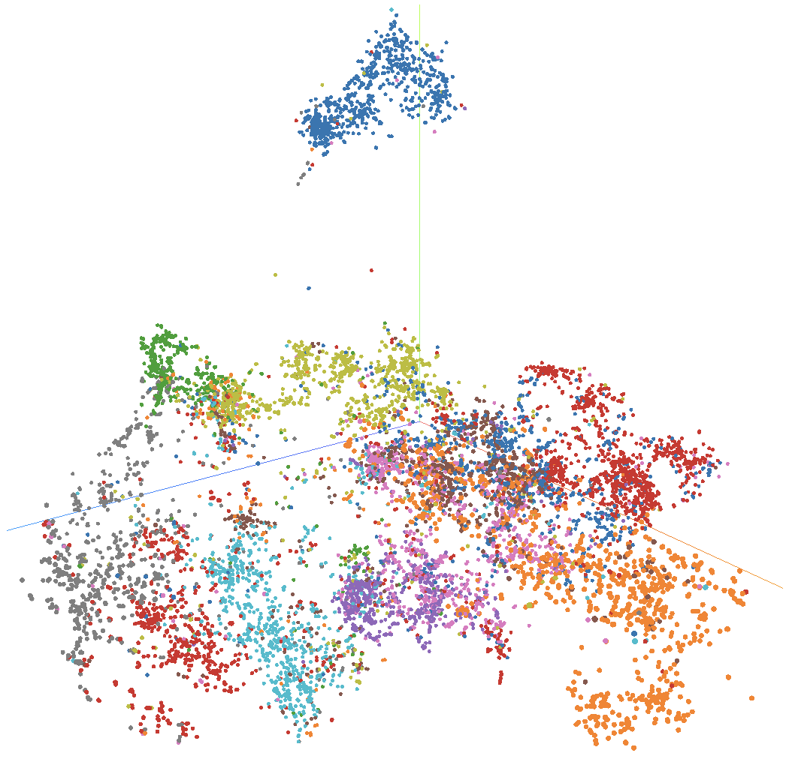
  <br>
  <em>t-SNE projection of finetuned ConvNeXt embeddings colored by super_class (3D).</em>
</p>

### Validation Performance (during training)

- Best validation Recall@1: 0.84
- Validation split created by holding out entire product instances (no class leakage)

### Within-test Retrieval Performance

The retrieval performance within the test set is shown for both the pretrained and fine-tuned models.

| Model                                | Recall@1 | Recall@5 | Recall@10 |
| ------------------------------------ | -------- | -------- | --------- |
| Pretrained ConvNeXt (no fine-tuning) | 0.59     | 0.70     | 0.74      |
| Fine-tuned (SupCon + PK sampling)    | 0.70     | 0.82     | 0.86      |

---

The improvement shows that supervised contrastive fine-tuning substantially improves the quality of the learned embedding space for retrieval. The following gains were made as shown in the table: Recall@1 has improved by ~19% (59% → 70%), Recall@5 by ~17% (70% → 82%) and Recall@10 by ~16% (74% → 86%).

### Visual Error Analysis

Quantitative metrics alone do not fully explain model behavior, so I performed qualitative error analysis by visualizing successful and failed retrievals.

Using `visualise_retrievals.py`, I did the following:

- Inspected top-K retrievals for randomly sampled queries in the test set
- Compared baseline vs fine-tuned models
- Saved failures and successes as structured artifacts (Parquet)

Some randomly selected top-K successes and failures in the test set are shown, based on the embeddings generated by the pretrained baseline and fine-tuned models. Successes or failures are based on retrievals matching the `class_id` of the queries in the foremost retrieval (top-1 or rank-1). The similarity scores of retrieved images with respect to the query are also shown, with the foremost retrieval having the highest score.

Successful queries are shown for the baseline model:

<p align="center">
  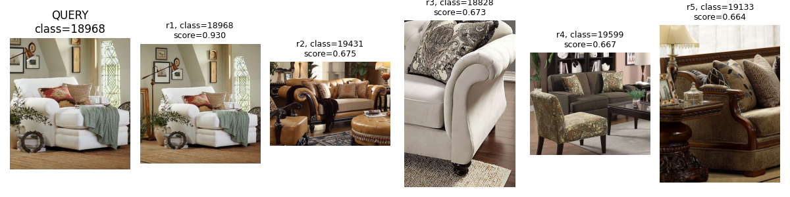
  <br>
  <em>Successful query (class_id=18968)</em>
</p>

<p align="center">
  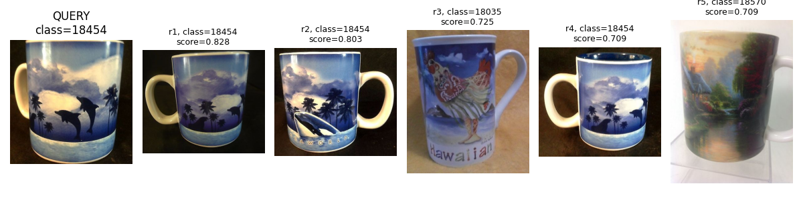
  <br>
  <em>Successful query (class_id=18454)</em>
</p>

<p align="center">
  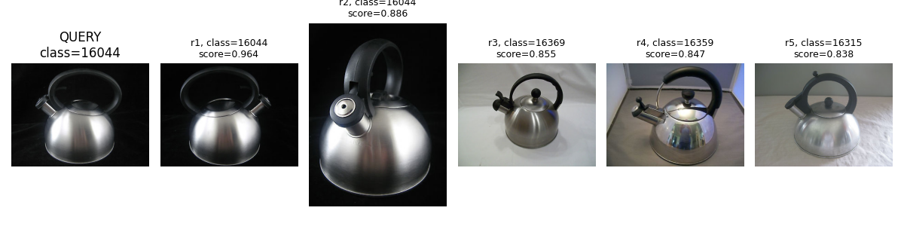
  <br>
  <em>Successful query (class_id=16044)</em>
</p>

In the successful queries, the top-1 retrieved images (with the highest scores) match the `class_id`. In addition, in each query, all retrieved images are visually similar.

These are some of the failed queries for the baseline model:

<p align="center">
  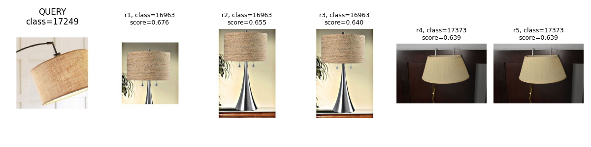
  <br>
  <em>Failed query (class_id=17249)</em>
</p>

<p align="center">
  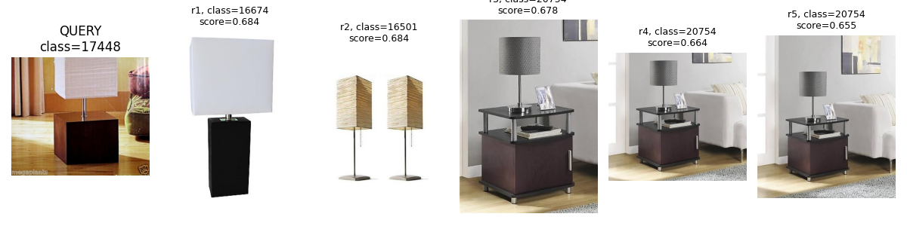
  <br>
  <em>Failed query (class_id=17448)</em>
</p>

<p align="center">
  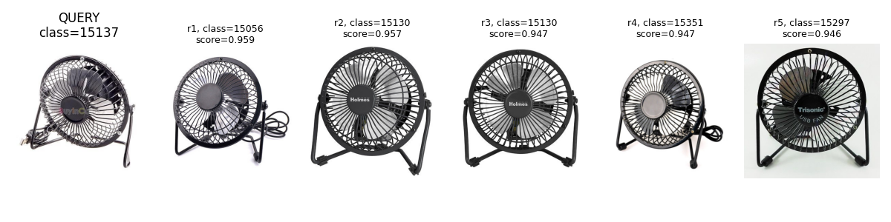
  <br>
  <em>Failed query (class_id=15137)</em>
</p>

<p align="center">
  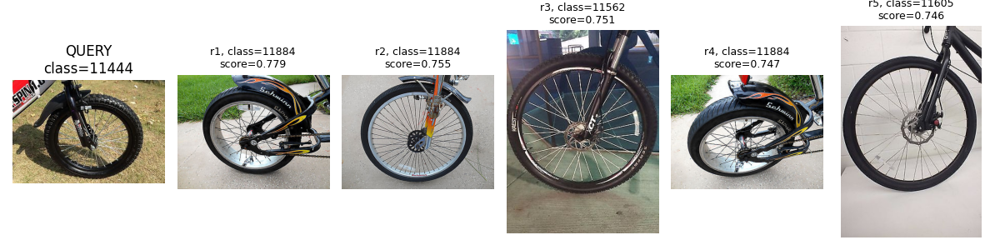
  <br>
  <em>Failed query (class_id=11444)</em>
</p>

Similarly, in the failed queries, the retrieved images are visually similar but the top-1 retrievals have a different `class_id`. The most common failure mode, having observed many random queries, can be attributed to ambiguity, because there are many instance where there are identical images across different `class_id`. As a result, even though the retrieved images in each query are visually similar to themselves and to the query and have high scores, the query is still categorised as a failure because the retrieved image in rank 1 is from a different `class_id`. Since there are at least 2 images of the same `class_id`, another reason for failure could be due to missing discriminative parts, views or backgrounds in the query which are absent in the correct class but present in identical images from a different class, thus causing those identical images to have higher scores and leading to a failed query instance. A more optimised result should lead to a better model which is able to minimise these failure modes, as the fine-tuned model clearly shows, as evidence in the Recall@1 score.

Some of the successful and failed queries are also shown for the fine-tuned model. It is obvious that, for each query, success is not now limited to the retrieved image rank-1 i.e., there are more retrieved images belong to the same class as the query e.g., the query of class 18376 has top-2 retrievals belonging to its class, query of class 15526 has the top-4 of similar class while the query of class 17424 has all top-5 retrievals of the same class. This is testament to the improvement in the capability of the model to generated better embedddings which lead to more quality retrievals.

<p align="center">
  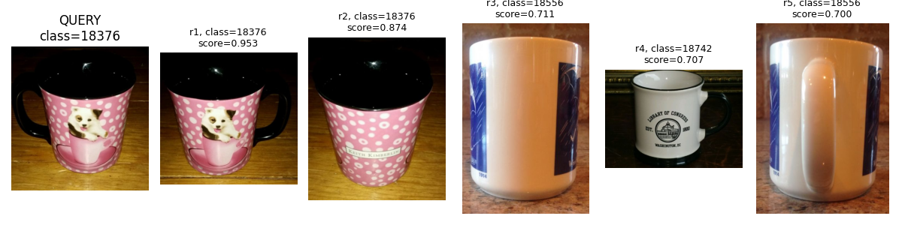
  <br>
  <em>Successful query (class_id=18376)</em>
</p>

<p align="center">
  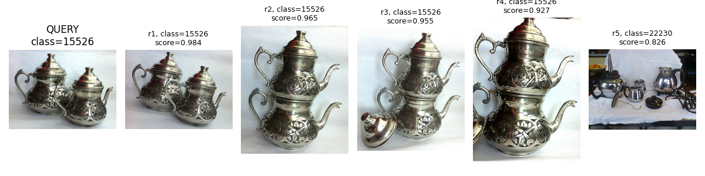
  <br>
  <em>Successful query (class_id=15526)</em>
</p>

<p align="center">
  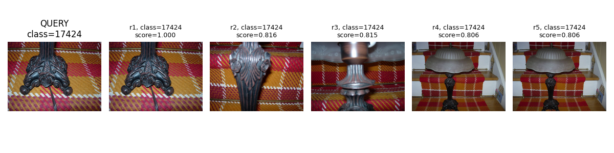
  <br>
  <em>Successful query (class_id=17424)</em>
</p>

Example failed queries are shown as well for the fine-tuned model. The reasons for the failed queries can be attributed to the same failure modes described earlier i.e., closely identical images belonging to different classes and missing backgrounds in the query image. A qualitative analyses of these failed queries prove that this image retrieval system is reliable in identifying visually similar images from queries.

<p align="center">
  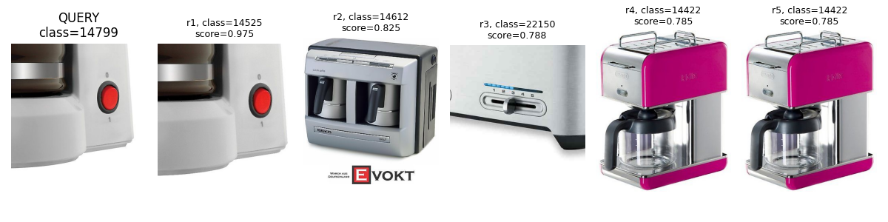
  <br>
  <em>Failed query (class_id=14799)</em>
</p>

<p align="center">
  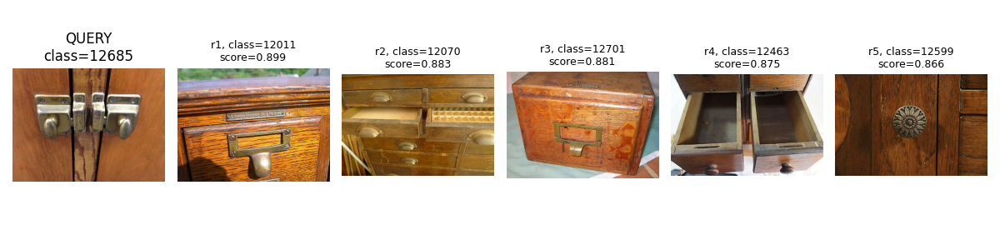
  <br>
  <em>Failed query (class_id=12685)</em>
</p>

<p align="center">
  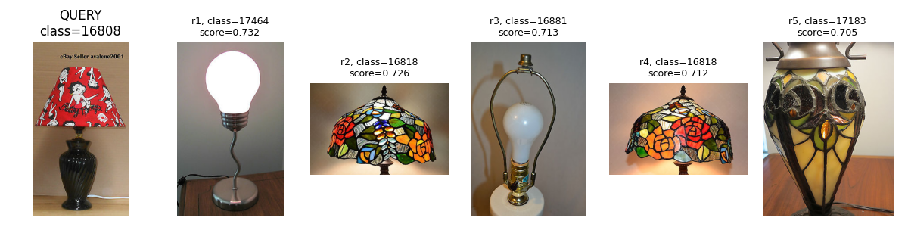
  <br>
  <em>Failed query (class_id=16808)</em>
</p>

## Real-world Queries: Domain Shift Robustness

To test robustness under **domain shift** (clean eBay product images → messy phone photos), I captured several real-world query images at home using my iPhone under different conditions (e.g., lighting, background, angle, etc.) and queried them against a catalog built from the SOP **train** split.

**Setup**

- **Catalog:** SOP train embeddings (FAISS index)
- **Queries:** personal phone photos (converted from HEIC → JPG)
- **Model:** fine-tuned ConvNeXt + projection head (256-D), L2-normalized embeddings, cosine similarity via FAISS inner product search

Below are some of the retrieval results from querying a variety of items in my home. The queried items include stapler, kettle, mug, chair, sofa and lamp. The query is on the left while the corresponding top-5 retrievals are plotted next to it.

<p align="center">
  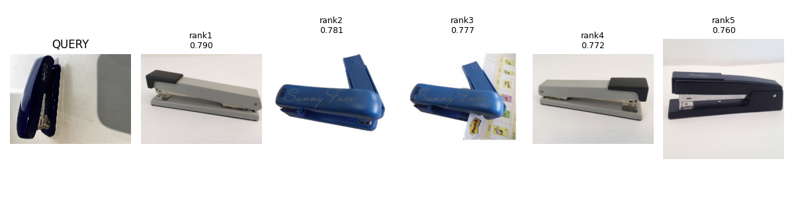
</p>

<p align="center">
  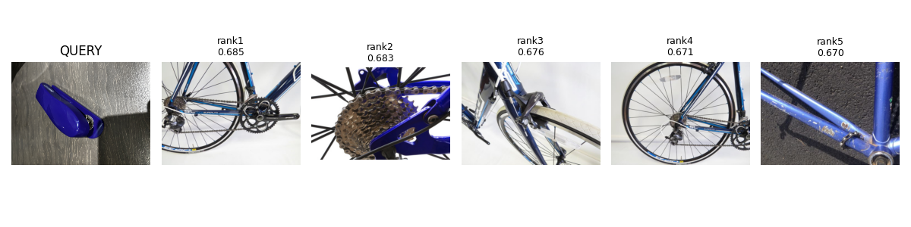
</p>

<p align="center">
  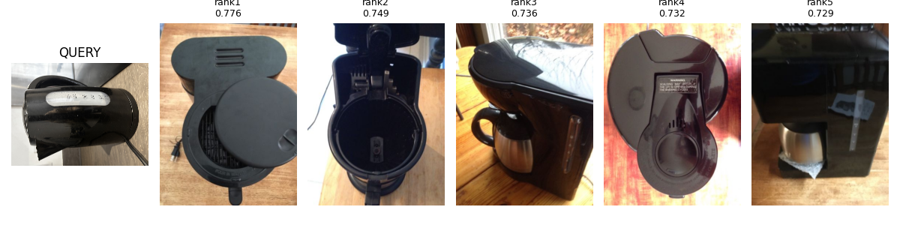
</p>

<p align="center">
  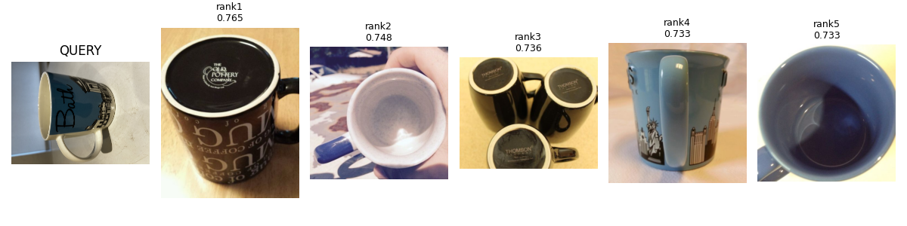
</p>

<p align="center">
  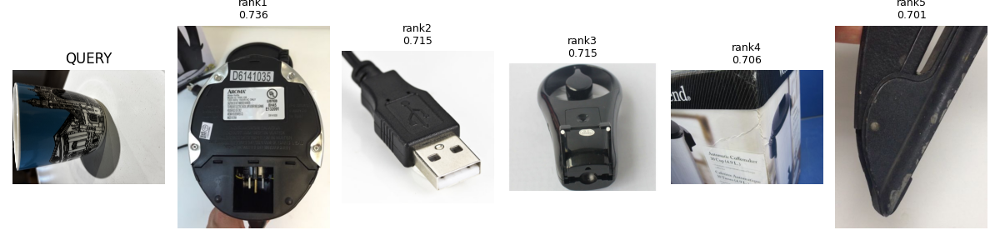
</p>

<p align="center">
  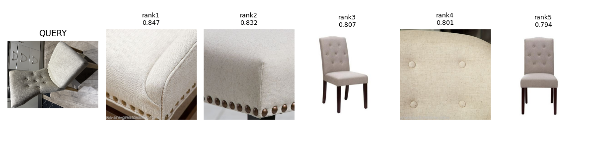
</p>

<p align="center">
  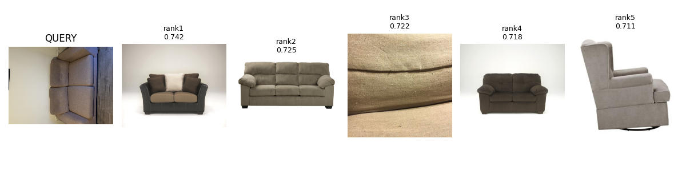
</p>

<p align="center">
  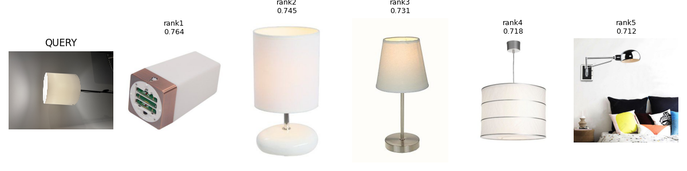
</p>

**What I observed**

- The model often retrieves visually plausible matches based on **shape** and **material** cues.
- Failure cases are frequently driven by **background clutter**, extreme **viewpoint changes**, or partial occlusions.

These observations motivate future work such as background segmentation/cropping for queries so that the model pays more attention to the object rather than the everything else in the background. Additionally, fine-tuning the model using in-domain images could be beneficial for retrieval.

> Note: These results are qualitative (no ground-truth labels for the home photos). The goal is to demonstrate real-world behavior and identify failure modes that guide further improvements.

## Repository Structure

```
visualise_similarity_sop/
├── artifacts/                                    # Generated artifacts (gitignored)
│   ├── checkpoints/                              # Model checkpoints
│   ├── retrieval_results/                        # Baseline retrieval results
│   ├── retrieval_results_finetuned/              # Fine-tuned retrieval results (building supervised contrastive loss from scratch)
│   ├── retrieval_results_finetuned_updated/      # Fine-tuned retrieval results (with pytorch-metric-learning)
│   ├── sop_embeddings/                           # Baseline embeddings + metadata
│   ├── sop_embeddings_finetuned/                 # Fine-tuned embeddings + metadata
│   ├── sop_embeddings_finetuned_updated/         # Fine-tuned embeddings + metadata (pytorch-metric-learning)
│   ├── tensorboard_embeddings/                   # TensorBoard projector exports (baseline)
│   └── tensorboard_embeddings_finetuned_updated/ # TensorBoard projector exports (pytorch-metric-learning)
├── data/
│   └── real_world_queries/
├── notebooks/
│   └── explore_dataset.ipynb
├── plots/
│   ├── embeddings_finetuned_model_2D.png
│   ├── embeddings_finetuned_model_3D.png
│   ├── embeddings_pretrained_model_2D.png
│   ├── embeddings_pretrained_model_3D_2.png
│   ├── embeddings_pretrained_model_3D.png
│   ├── images_per_class_id.png
│   ├── retrievals_failures_finetuned_updated/
│   ├── retrievals_failures_pretrained/
│   ├── retrievals_success_finetuned_updated/
│   └── retrievals_sucesses_pretrained/
├── poetry.lock
├── pyproject.toml
├── README.md
└── scripts/
    ├── eval_retrieval.py
    ├── evaluate_retrieval_within_split.py
    ├── export_tensorboard_projector.py
    ├── extract_embeddings_finetuned.py
    ├── extract_embeddings.py
    ├── query_real_world_images.py
    ├── train_metric_learning_updated.py
    ├── train_metric_learning.py
    ├── visualise_dataset.py
    ├── visualise_embeddings.py
    └── visualise_retrievals.py

```

## How to Run

This project uses Poetry for dependency management. Install dependencies using:

```
poetry install
poetry shell
```

### Train the metric learning model

```
python scripts/train_metric_learning_updated.py
```

This trains a ConvNeXt-based embedding model using supervised contrastive loss with PK sampling and early stopping.

### Extract embeddings

Baseline:

```
python scripts/extract_embeddings.py
```

Fine-tuned:

```
python scripts/extract_embeddings_finetuned.py
```

### Evaluate retrieval

```
python scripts/evaluate_retrieval_within_split.py
```

This computes Recall@K using FAISS and saves results to `artifacts/retrieval_results` for baseline or `artifacts/retrieval_results_finetuned` for fine-tuned model.

### Visualise retrieval results

```
python scripts/visualise_retrievals.py
```

Displays random examples of successful and failed retrievals for qualitative analysis.

### Query the catalog with real-world photos (domain shift demo)

1. Add your query image set to `data/real_world_queries/` (JPG/PNG).
2. Run:

```
python scripts/query_real_world_images.py
```

## Key Takeaways

- Metric learning substantially improves retrieval quality over pretrained features (up to 19% increase in Recall@1)
- Supervised contrastive loss is stable and effective for SOP-style datasets
- PK sampling is critical when many classes have only a few examples
- Visual error analysis reveals failure modes not visible in aggregate metrics

## Possible Extensions

- Hard negative mining with triplet loss fine-tuning
- Background segmentation for query images
- Lightweight demo app (Streamlit / FastAPI) for interactive querying

## Notes

- The SOP dataset is not included in this repository
- Paths to the dataset must be configured locally before running scripts
- Artifacts (embeddings, checkpoints, FAISS outputs) are excluded from version control
